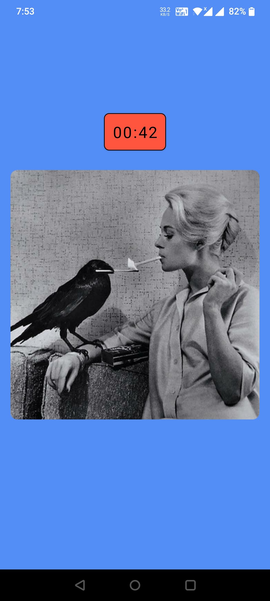
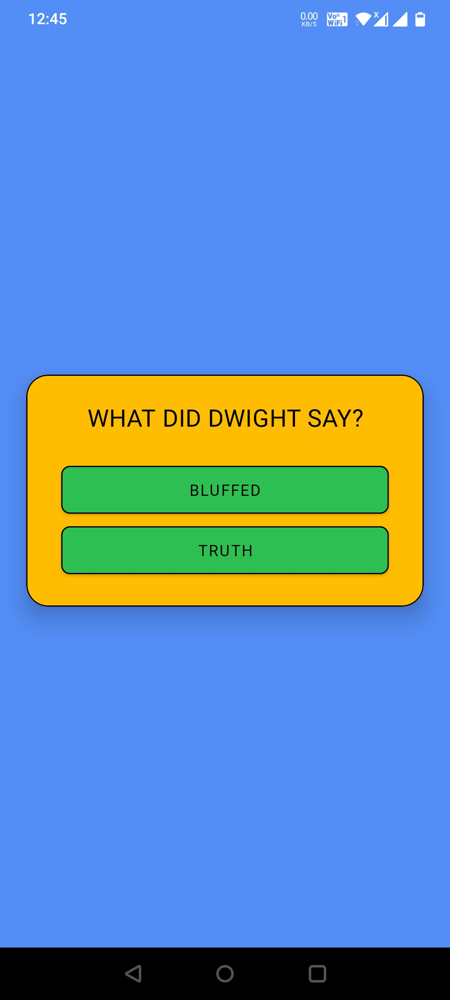

<h1 align="center">Bluffer</h1>

<p align="center">  
🎭 Bluffer is a two-player game in which one player looks at some weird image on the screen and explains it to the other player. The other player has to guess whether it is true or not. 🎭
</p>

## Preview

<p float="left">
  
   
  
  
   
  
  
   
  
</p>


## Tech stack & Open-source libraries

- Minimum SDK level 21
- [Kotlin](https://kotlinlang.org/) - Modern, concise and safe programming language
- [Coroutines](https://github.com/Kotlin/kotlinx.coroutines) - A concurrency design pattern to execute code asynchronously.
- Jetpack
  - Lifecycle - Observe Android lifecycles and handle UI states upon the lifecycle changes.
  - Navigation - Implements navigation from simple button clicks to more complex patterns.
  - ViewModel - Manages UI-related data holder and lifecycle aware. Allows data to survive configuration changes such as screen rotations.
  - LiveData - LiveData is lifecycle-aware, meaning it respects the lifecycle of other app components, such as activities, fragments, or services.
  - ViewBinding - Binds UI components in your layouts to data sources in your app using a declarative format rather than programmatically.
- Architecture
  - MVVM Architecture (View - ViewModel - Network)
- [Retrofit2](https://github.com/square/retrofit) - Construct the REST APIs.
- [Moshi](https://github.com/square/moshi/) - A modern JSON library for Kotlin and Java.
- [Coil](https://github.com/coil-kt/coil) - An image loading library for Android backed by Kotlin Coroutines
- [Material-Components](https://github.com/material-components/material-components-android) - Material design components for building View layouts and Animations.


## Download
Go to the [Releases](https://github.com/ArjunJadeja/Bluffer/releases) to download the latest APK.


## MAD Score


## Open API

- Bluffer using the [SubredditApi](https://meme-api.herokuapp.com/gimme/hmmm) for constructing RESTful API.<br>

- This API provides a RESTful API interface for any subreddit. All the data is fetched from [/hmmm](https://www.reddit.com/r/hmmm/) subreddit.

- Github repository of author - [Github](https://github.com/D3vd/Meme_Api)


## License
```xml
MIT License

Copyright (c) 2022 Arjun Jadeja

Permission is hereby granted, free of charge, to any person obtaining a copy
of this software and associated documentation files (the "Software"), to deal
in the Software without restriction, including without limitation the rights
to use, copy, modify, merge, publish, distribute, sublicense, and/or sell
copies of the Software, and to permit persons to whom the Software is
furnished to do so, subject to the following conditions:

The above copyright notice and this permission notice shall be included in all
copies or substantial portions of the Software.

THE SOFTWARE IS PROVIDED "AS IS", WITHOUT WARRANTY OF ANY KIND, EXPRESS OR
IMPLIED, INCLUDING BUT NOT LIMITED TO THE WARRANTIES OF MERCHANTABILITY,
FITNESS FOR A PARTICULAR PURPOSE AND NONINFRINGEMENT. IN NO EVENT SHALL THE
AUTHORS OR COPYRIGHT HOLDERS BE LIABLE FOR ANY CLAIM, DAMAGES OR OTHER
LIABILITY, WHETHER IN AN ACTION OF CONTRACT, TORT OR OTHERWISE, ARISING FROM,
OUT OF OR IN CONNECTION WITH THE SOFTWARE OR THE USE OR OTHER DEALINGS IN THE
SOFTWARE.
```
